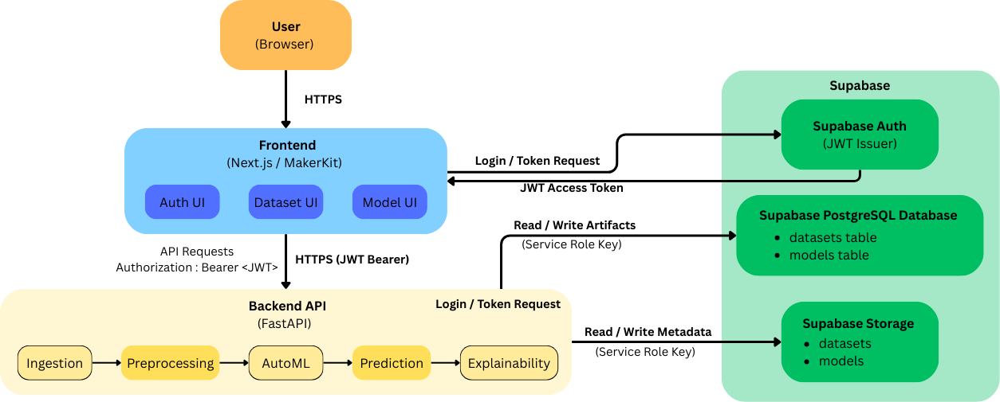

System Architecture
===================

Overview
--------

Forecasting-Platform follows a modular, service-oriented architecture designed
to support reproducible forecasting workflows while maintaining clear separation
between user interaction, business logic, and infrastructure concerns.

The system is composed of three primary layers:

- A **web-based frontend** for user interaction
- A **backend API service** for data processing and machine learning workflows
- A **managed backend infrastructure** layer for authentication, storage, and persistence

Each layer has a well-defined responsibility and communicates with others
through explicit interfaces.

High-Level Architecture
-----------------------

   High-level system architecture showing frontend, backend API, and Supabase.

At a high level:

- The frontend communicates exclusively with the backend API and Supabase Auth
- The backend API acts as the single orchestrator of all data and ML operations
- Supabase provides authentication, object storage, and relational persistence

Frontend Layer
--------------

The frontend is implemented as a Next.js application built on top of the
MakerKit SaaS template.

Its primary responsibilities include:

- User authentication and session management
- Dataset upload and configuration
- Model training configuration and monitoring
- Visualization of metrics, predictions, and explainability outputs

The frontend does **not** contain any machine learning logic and does not access
privileged resources directly. All protected operations are delegated to the backend API.

Backend API Layer
-----------------

The backend is implemented as a FastAPI service and serves as the system’s
control plane.

Its responsibilities include:

- Validating user identity using JWT tokens
- Managing dataset ingestion and preprocessing
- Orchestrating model training and evaluation
- Generating predictions
- Computing and serving explainability artifacts

The backend enforces all business rules and acts as the sole authority for
accessing private storage buckets and writing metadata to the database.

Infrastructure Layer (Supabase)
--------------------------------

Supabase is used as a managed backend infrastructure layer and provides three
core services:

Authentication
^^^^^^^^^^^^^^

Supabase Auth is used to authenticate users and issue JWT access tokens.
These tokens are:

- Obtained by the frontend
- Attached to API requests as Bearer tokens
- Validated by the backend for every protected operation

Storage
^^^^^^^

Supabase Storage is used as an object store for large artifacts, including:

- Raw datasets (CSV, Parquet)
- Processed datasets
- Trained model artifacts
- Explainability outputs

Separating object storage from relational metadata enables efficient handling
of large files without overloading the database.

Database
^^^^^^^^

The Supabase PostgreSQL database stores structured metadata, including:

- Dataset records
- Model records
- Training configurations
- Evaluation summaries

The database acts as the system’s source of truth for experiment tracking
and artifact discovery.

Authentication & Security Model
--------------------------------

The platform follows a strict security boundary model:

- The frontend uses **public Supabase credentials** only
- The backend uses **service role credentials** stored securely in environment variables
- Service role keys are never exposed to the frontend

A typical authenticated request flow:

1. User authenticates via Supabase Auth in the frontend
2. Frontend receives a JWT access token
3. Frontend sends API requests with ``Authorization: Bearer <token>``
4. Backend validates the token and authorizes the operation
5. Backend accesses storage or database resources as needed

This design ensures that privileged operations are confined to the backend.

Scalability & Extensibility Considerations
------------------------------------------

The architecture is intentionally modular:

- Frontend and backend can be deployed independently
- Storage and database scale independently of compute
- New model families or preprocessing steps can be added
  without changing the frontend

This design supports future extensions such as:

- Additional validation strategies
- New explainability methods
- Alternative storage backends
- Distributed training workloads

