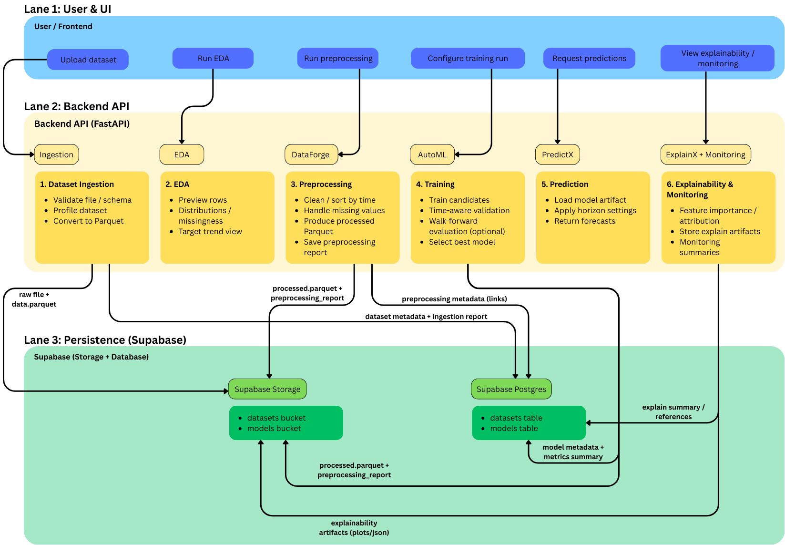

Forecasting Pipeline
====================

Overview
--------

This document describes the end-to-end forecasting pipeline implemented by
Forecasting-Platform. The pipeline is designed to make forecasting workflows:

- reproducible (explicit steps, persisted artifacts)
- traceable (datasets, models, metrics, and explanations are linked)
- scientifically sound (time-aware validation and leakage avoidance)
- operable (clear lifecycle stages and predictable interfaces)

At a high level, the pipeline moves through six stages:

1) Dataset ingestion
2) Exploratory analysis (EDA)
3) Preprocessing (DataForge)
4) AutoML training and evaluation
5) Prediction (inference)
6) Explainability and monitoring

The system intentionally separates these stages to avoid hidden coupling between
data preparation, training, and inference, and to allow each stage to evolve
independently.

Pipeline Diagram
----------------

   End-to-end workflow: upload → profile → preprocess → train → predict → explain.

(If the diagram is not present, the pipeline description below remains complete.)

Stage 1 — Dataset Ingestion
---------------------------

Goal
^^^^

Convert an uploaded dataset into a standardized, persistent representation that
can be safely reused by downstream stages.

Why this stage exists
^^^^^^^^^^^^^^^^^^^^^

Forecasting workflows often fail due to inconsistent dataset handling:

- schema ambiguity (date column type, target column type)
- missing or invalid values
- mixed column types or unexpected categorical encoding
- large raw files that are costly to read repeatedly

By standardizing ingestion, the system establishes a stable contract for all
subsequent pipeline stages.

Inputs
^^^^^^

- A dataset file (commonly CSV; Parquet may also be supported depending on configuration)
- Ingestion configuration (such as detected/selected target column, date column)

Outputs
^^^^^^^

- A dataset identifier (used to reference it everywhere)
- Ingestion metadata and profiling summary
- Stored artifacts in object storage:
  - the original upload
  - a normalized Parquet representation (preferred downstream format)

Persisted artifacts (typical)
^^^^^^^^^^^^^^^^^^^^^^^^^^^^^

Stored in the ``datasets`` bucket:

- ``<dataset_id>/raw.<ext>``
- ``<dataset_id>/data.parquet``

Persisted metadata (typical)
^^^^^^^^^^^^^^^^^^^^^^^^^^^^

Stored in the ``datasets`` table:

- dataset name, timestamps
- schema summary (columns, types)
- profiling reports
- links (paths) to stored objects

Key quality checks
^^^^^^^^^^^^^^^^^^

Ingestion is responsible for surfacing issues early, such as:

- invalid datetime parsing
- missing target column
- empty dataset
- unsupported file types
- inconsistent schema across rows

Stage 2 — Exploratory Data Analysis (EDA)
-----------------------------------------

Goal
^^^^

Provide a lightweight, structured exploration of the dataset to help users validate:

- whether the dataset is suitable for forecasting
- which features are useful
- whether the target behaves as expected

Why this stage exists
^^^^^^^^^^^^^^^^^^^^^

EDA is not just visualization; it is a decision stage:

- identify missingness and outliers
- understand distributions and trends
- confirm time ordering and frequency
- detect leakage risks (features that encode future info)

The platform includes EDA as a formal stage so that analysis outputs are consistent
and can be used to justify downstream modeling decisions.

Typical outputs
^^^^^^^^^^^^^^^

- A preview of rows (sample)
- Numeric distributions / histograms
- Time-series view of target values (if a datetime index exists)
- Missingness summary
- Basic descriptive statistics

Persistence
^^^^^^^^^^^

EDA results may be returned as API responses.
Optionally, summarized EDA reports can also be persisted as part of dataset metadata.

Stage 3 — Preprocessing (DataForge)
-----------------------------------

Goal
^^^^

Transform raw/ingested data into a model-ready dataset while preserving the ability
to reproduce the transformation.

Why preprocessing is separated from training
^^^^^^^^^^^^^^^^^^^^^^^^^^^^^^^^^^^^^^^^^^^^

In many ML systems, preprocessing is embedded inside the training pipeline.
This makes it difficult to:

- audit what transformations were applied
- reuse the same cleaned dataset across experiments
- debug why results changed
- avoid leakage when preprocessing depends on future data

Forecasting-Platform isolates preprocessing so:

- users can inspect the processed dataset
- the same processed dataset can be used for multiple model runs
- transformations are explicit and reproducible

Core preprocessing operations (typical)
^^^^^^^^^^^^^^^^^^^^^^^^^^^^^^^^^^^^^^^

Depending on dataset characteristics and configuration:

- Duplicate removal
- Sorting by time index (and entity keys when applicable)
- Missing value handling (drop, fill, interpolation)
- Column normalization (type casting, trimming, standardization)
- Removal of constant or unusable features
- Optional reindexing for regular time frequency (where appropriate)

Time-series considerations
^^^^^^^^^^^^^^^^^^^^^^^^^^

Preprocessing must respect temporal structure:

- sorting by time is mandatory for forecasting datasets
- resampling/reindexing should be applied carefully, especially with irregular series
- interpolation is only scientifically valid under justified assumptions about continuity

Outputs
^^^^^^^

- A processed dataset artifact (Parquet)
- A preprocessing report describing what was changed

Persistence
^^^^^^^^^^^

Stored in ``datasets`` bucket (typical):

- ``<dataset_id>/processed.parquet``
- ``<dataset_id>/preprocessing_report.json``

Metadata stored in ``datasets`` table may include:

- preprocessing settings used
- references to stored processed artifacts

Stage 4 — AutoML Training and Evaluation
----------------------------------------

Goal
^^^^

Train and evaluate multiple candidate models under consistent conditions,
select the best-performing model, and persist all relevant artifacts.

Why AutoML
^^^^^^^^^^

Forecasting systems commonly require comparing heterogeneous model families.
AutoML is used to:

- reduce manual boilerplate
- enforce consistent training/evaluation procedures
- provide a controlled search over reasonable baselines and configurations
- enable repeatable benchmarking

Importantly, the platform treats AutoML as a **structured benchmarking process**
rather than an opaque black box.

Candidate model families
^^^^^^^^^^^^^^^^^^^^^^^^

The platform may include multiple families, for example:

- **Tabular models**:
  - regression-based models using engineered features
- **Sequence models**:
  - models operating on temporal windows (lookback sequences)

The model family choice depends on dataset structure and user configuration.

Scientific requirements: time-aware validation
^^^^^^^^^^^^^^^^^^^^^^^^^^^^^^^^^^^^^^^^^^^^^^

A core requirement in forecasting is avoiding leakage. Random train/test splits
often violate time ordering and produce over-optimistic evaluation.

Preferred strategies include:

- time-based holdout (train on past, validate on future)
- walk-forward evaluation (rolling-origin backtesting)

Walk-forward evaluation (conceptual)
^^^^^^^^^^^^^^^^^^^^^^^^^^^^^^^^^^^^

Walk-forward evaluation simulates real usage by repeatedly training on historical
segments and validating on subsequent future windows.

Benefits:

- approximates real deployment conditions
- reveals performance stability over time
- reduces sensitivity to a single split point

Trade-offs:

- more computationally expensive than a single holdout split
- requires careful configuration of window sizes

Metrics and model selection
^^^^^^^^^^^^^^^^^^^^^^^^^^^

Model selection should be based on a defined metric set such as:

- MAE, RMSE (error magnitude)
- MAPE/SMAPE (relative error where valid)
- R² (in regression contexts; interpret carefully for forecasting)

The platform selects a best candidate based on configured scoring and persists:

- evaluation summaries for each candidate
- the best model artifact
- training configuration used

Outputs
^^^^^^^

- A trained model artifact (serialized model)
- Evaluation report (metrics, plots summary, comparisons)
- Model metadata record linking:
  - dataset id
  - preprocessing version
  - configuration
  - metrics
  - artifact paths

Persistence
^^^^^^^^^^^

Stored in ``models`` bucket (typical):

- ``<model_id>/model.<ext>``
- ``<model_id>/metrics.json``
- optional: scalers/encoders
- optional: plots and explainability artifacts

Stored in ``models`` table (typical):

- model id, dataset id
- algorithm type and configuration
- metrics summary
- artifact references (storage paths)

Stage 5 — Prediction (Inference)
--------------------------------

Goal
^^^^

Use a persisted trained model artifact to generate forecasts on demand.

Why inference is a separate stage
^^^^^^^^^^^^^^^^^^^^^^^^^^^^^^^^^

Forecasting-Platform separates inference so that:

- predictions can be generated repeatedly without retraining
- production and evaluation can reuse the same artifact
- inference behavior can be tested independently from training

Inputs
^^^^^^

- model identifier (select which trained artifact to use)
- dataset identifier or new input payload
- prediction configuration:
  - forecasting horizon
  - optional entity selection (multi-series)
  - optional feature columns selection

Tabular vs sequence inference behavior
^^^^^^^^^^^^^^^^^^^^^^^^^^^^^^^^^^^^^^

- Tabular models typically expect feature vectors for each prediction row.
- Sequence models typically require:
  - a lookback window length
  - consistent scaling / encoding
  - sufficient historical context per entity

The system may return explicit validation errors when there is insufficient context
(e.g., fewer rows than lookback).

Outputs
^^^^^^^

- predictions array/time series
- optional confidence intervals (if supported by model family)
- metadata such as:
  - horizon used
  - timestamps
  - model and dataset identifiers

Persistence (optional)
^^^^^^^^^^^^^^^^^^^^^^

Predictions may be returned immediately to the user.
If required, they can also be stored as artifacts for auditability
(e.g., storing prediction outputs for later comparison).

Stage 6 — Explainability & Monitoring
-------------------------------------

Goal
^^^^

Provide interpretation for model behavior and monitor performance and stability.

Explainability (ExplainX)
^^^^^^^^^^^^^^^^^^^^^^^^^

Explainability outputs aim to answer:

- Which features are most influential?
- How does a feature change prediction outcomes?
- Are there dominant drivers that indicate leakage or bias?

Typical explainability outputs:

- global feature importance rankings
- per-feature contribution summaries
- optional local explanations (depending on model compatibility)

Explainability artifacts are treated as first-class outputs and can be stored
alongside model artifacts.

Monitoring
^^^^^^^^^^

Monitoring in the platform is designed to surface operational questions:

- Which datasets exist and how often are they used?
- Which models are deployed/selected most frequently?
- Are recent predictions deviating from historical behavior?
- Are errors stable across time windows?

In early versions, monitoring may focus on metadata-driven summaries
(datasets/models counts, recent runs, stored metrics).
Future extensions can include drift detection and continuous evaluation.

End-to-End Traceability
-----------------------

A central property of the pipeline is that objects are linked across stages:

- A model is always associated with a dataset (and its processed form)
- A prediction is always associated with a model artifact
- Explainability outputs are always associated with a model artifact

This traceability enables auditability:

- reproduce the training run
- recover preprocessing decisions
- compare models fairly
- justify forecasts with explanations
